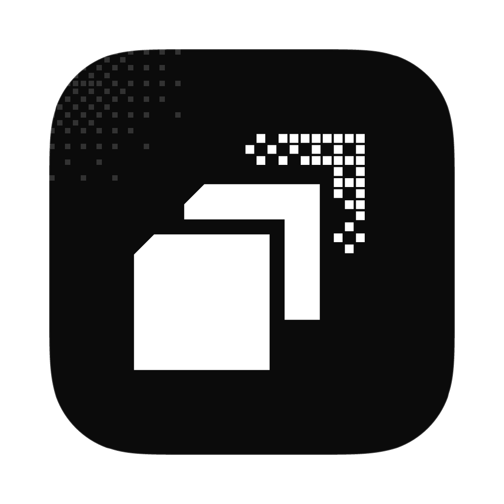

<p align="center">
  
</p>
<p align="center">
  <a href="https://lsuite.xyz/nori">Website</a> ·
  <a href="https://lsuite.xyz/nori/download">Download</a> ·
  <a href="https://lsuite.xyz/nori/support">Support</a>
</p>

<h1 align="center">nori</h1>

<p align="center"><strong>Pictures, drawings and pages in one app.</strong> (beta, Linux; macOS and Windows coming soon)<br/>
Native Rust app (GPUI) · drivable by your AI (MCP, CLI, built-in agent).<br/>
Part of <a href="https://lsuite.xyz">lsuite</a>, the free, open-source creative suite your AI can drive.</p>

---

nori retouches photos with layers, masks and adjustment layers, draws with the pen, shapes and
gradients, and lays out posters and booklets with text that flows from page to page — in one
window, with one undo history your agent shares. Free and open source (MIT), written in Rust, in
beta.

## What it does

- **Photos and painting.** PNG, JPEG, WebP, TIFF, BMP, GIF; pixel layers with blend modes,
  opacity, masks and clipping; adjustment layers (Levels, Curves, Hue/Saturation, Exposure,
  Brightness/Contrast, Vibrance, Black & White, Invert, Threshold, Posterize, and Color Lookup
  from `.cube` files); brush and eraser (hardness, flow, pen pressure, GIMP brush tips); paint
  bucket, gradients; selections (rectangle, ellipse, lasso, magic wand, from a layer; grow,
  shrink, feather); filters (Gaussian and motion blur, sharpen, noise, pixelate); crop, image and
  canvas size, transforms.
- **Drawings.** Shapes with live corners (rectangle, ellipse, polygon, star, line), the pen for
  Bézier paths and direct selection of their points, fills, strokes, dashes and gradients, path
  operations (unite, subtract, intersect, exclude). SVG in and out.
- **Pages.** Several pages or artboards in one document, master pages, margins, columns and
  guides; text frames whose words flow from frame to frame across pages; paragraph and character
  styles; page numbers; PDF export with every page, vector shapes and selectable embedded text.
- **Coming from another editor.** Photoshop documents open with their layers (also what
  Affinity Photo, Pixelmator Pro and Photopea save); layered PSD export; OpenRaster from Krita and GIMP; 8-bit RGB/gray GIMP XCF (versions 0–13); PDF and PDF-compatible Illustrator files; IDML in and out; SVG from
  Illustrator, Inkscape, Figma, Affinity Designer, Canva and Scribus. Adobe swatches (`.ase`) and
  GIMP brushes (`.gbr`) import too.
- **Documents and originals.** Multiple tabs retain their own undo histories. Embedded smart objects preserve editable native sources; repeated resizing samples the original. RGB/channel curves have a draggable graph.
- **The file.** A `.nori` document is a zip of `document.json` and PNGs: open it with any zip
  tool. See [docs/FILE_FORMAT.md](docs/FILE_FORMAT.md).

## Install

nori is in beta for **Linux**; macOS and Windows are coming soon. Download the file from the
[latest release](https://github.com/ludovic111/nori/releases/latest):

| System | File |
| --- | --- |
| Linux | `nori_amd64.AppImage` or `nori_amd64.deb` |
| macOS, Windows | coming soon |

Signed app updates are available in Settings → Updates (no account needed); checksums and
signatures are verified before installation.

Or install it with the [lsuite launcher](https://lsuite.xyz/launcher).

## Drive it from AI and scripts

The Agent panel (⌘J) runs the model you already have: your own Claude Code, Codex, Anthropic or
OpenAI key, or a model on Ollama or any OpenAI-compatible server. It works through the same
commands as the window; each change is a step you can undo, and a run can be reverted at once.
`nori-mcp` gives every command to any MCP client; `nori-cli` to scripts. Every agent gets the
same harness: a designer's brief, eleven skills (poster, retouch, logo, booklet, brand kit…), a
live view of the document before each step, and `harness.look` / `harness.check` to see and
measure the work (contrast, bleed, resolution, overflow) before it says it's done; `evals/`
scores it on real design jobs. See [docs/AI_CONTROL.md](docs/AI_CONTROL.md) and
[docs/COMMANDS.md](docs/COMMANDS.md).

```sh
claude mcp add nori -- /Applications/nori.app/Contents/MacOS/nori-mcp --live    # Claude Code
nori-cli mcp-config                                                             # the line for Claude Code, Codex, Cursor and Claude Desktop
nori-cli --file poster.nori agent "Make an A3 poster for …" --provider claude-code  # the built-in agent, without the window
```

## Plugins

Filters written in Rust with the nori SDK (`crates/nori-plugin`, see its
[guide](crates/nori-plugin/GUIDE.md)) load without a restart. Describe one in Plugins › Build with
your agent and the agent writes, builds and installs it. Two examples ship in
[`plugins/`](plugins): Duotone and Halftone.

## Works with the rest of lsuite

Send a picture straight to kimchi's timeline (`handoff.toKimchi`); nori tells the other lsuite
apps it is here (`~/.lsuite/apps/nori.json`).

## Documentation

- [docs/README.md](docs/README.md): the documentation index
- [docs/AI_CONTROL.md](docs/AI_CONTROL.md): driving nori from agents and scripts (the Agent panel, `nori-mcp`, `nori-cli`, the bridge)
- [docs/COMMANDS.md](docs/COMMANDS.md): every command, generated from the registry
- [docs/FILE_FORMAT.md](docs/FILE_FORMAT.md): the `.nori` file
- [crates/nori-plugin/GUIDE.md](crates/nori-plugin/GUIDE.md): writing a plugin
- [evals/RESULTS.md](evals/RESULTS.md): the agent evals and their scores
- [CHANGELOG.md](CHANGELOG.md): what each release brought

## Architecture

```
crates/
  nori-core       the document model: canvas, layers, masks, selection, one undo history, the .nori file format
  nori-render     the renderer: tiled compositing, blend modes, adjustments, filters, the brush engine, transforms and text
  nori-io         pictures in and out, PSD and OpenRaster layers, SVG vectors in and out, PDF out, brushes and swatches
  nori-control    the command registry: one named, validated set of commands shared by the window, the agent, the CLI and MCP
  nori-agent      the built-in agent: the person's own model (Claude Code, Codex, API keys, local) over the command registry
  nori-plugin     the plugin SDK: a frozen C ABI for filters that work on RGBA f32 tiles with typed parameters
  nori-desktop    the window (GPUI), binary `nori`
  nori-cli        `nori-cli`: every registry command, on the running app or on a .nori file
  nori-mcp        `nori-mcp`: a Model Context Protocol server (stdio), every registry command is a tool
  nori-release    signs update archives with the Tauri-format minisign key and writes latest.json (no Node needed)
evals/            the agent evals: design jobs run headless with a real model, scored automatically (RESULTS.md)
plugins/
  duotone         example plugin: maps dark tones to one colour and light tones to another
  halftone        example plugin: a print halftone of round dots on a grid
```

## Development

Rust 1.92 or later. Linux needs GPUI's usual libraries (see
[`.github/workflows/ci.yml`](.github/workflows/ci.yml)).

```sh
cargo run -p nori                 # the app
cargo run -p nori-cli -- --help   # the CLI
cargo test --workspace
scripts/bundle-linux.sh           # the AppImage and .deb (macOS and Windows bundles: coming soon)
```

### Release builds

nori's builds come to people through the lsuite app (lsuite's DISTRIBUTION.md). The suite workflow in `ludovic111/kimchi/.github/workflows/suite-build.yml` builds and signs an exact nori commit for Linux (macOS and Windows are coming soon: their code stays, but they are neither built nor shipped during the beta); `scripts/publish-build.sh <version> <run-id>` then checks every signature, writes `latest.json` and `SHA256SUMS`, and creates `nori-v<version>` in the private `ludovic111/lsuite-builds` (try `--dry-run` first). The repository's standalone release workflow is manual and refuses unsigned releases when credentials are missing.

## Limits

### Beta interoperability and pressure

PSD export retains raster layers, names, opacity and supported blending; text, vector and effect layers use rendered fallbacks. IDML export retains simple text frames, threading, paths and embedded pictures; complex effects are rasterized. These round trips are covered by automated tests, but have not yet been opened in Photoshop or InDesign. PDF import converts text to outlines; PDF export keeps ordinary text selectable. Illustrator import requires PDF compatibility; private Illustrator editing data and legacy PostScript AI are unsupported.

XCF import supports 8-bit nonlinear RGB/grayscale, groups, masks and raw/RLE/zlib tiles through version 13. Unsupported precision, indexed color, blend modes and newer versions return an explicit error; export OpenRaster from GIMP for those documents.

Pressure size and flow controls are in the brush toolbar. macOS reads tablet pressure from the current native tablet event; actual tablet hardware still needs verification. Linux and Windows currently use full mouse pressure in the canvas because the pinned GUI backend does not expose tablet samples. The command API accepts pressure samples on every platform.

Smart objects have **Edit contents**, **Replace contents**, width/height and **Rasterize** controls. Save the source tab and replace the contents to apply edits. Rotation/flipping and destructive pixel filters require rasterizing first; resizing and replacement retain the embedded original.

## License

MIT. Fonts: Chakra Petch, Manrope and IBM Plex Mono (SIL OFL). Icons: Lucide (ISC).
The logos in `crates/nori-desktop/assets/logos` belong to their owners
([sources](crates/nori-desktop/assets/logos/SOURCES.md)).

nori is free. If it helps you, [support it](https://lsuite.xyz/nori/support).
